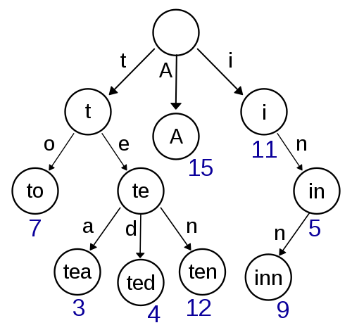

### Simple auto-complete engine implementation in golang.

### Quick start 
```shell
$ git clone https://github.com/benbarron/trie-auto-completion-engine
$ cd trie-auto-completion-engine
$ make build 
$ make run 
```

Initialize a trie
```shell
curl -XGET localhost:3000/trie/initialize
```

Add Words to tree 
```shell
curl -X POST http://localhost:3000/trie/enroll/:id \
  -H "Content-Type: application/json" \
  --data-binary "@words.json"
```

Preform autocompletion
```shell
curl -X POST http://localhost:3000/trie/search/:id \
  -H "Content-Type: application/json" \
  --data "{\"prefix\":\"A\"}"
```

### Structure of a prefix tree (trie)


References
- https://gitlab.com/tsoding/trie
- https://en.wikipedia.org/wiki/Trie